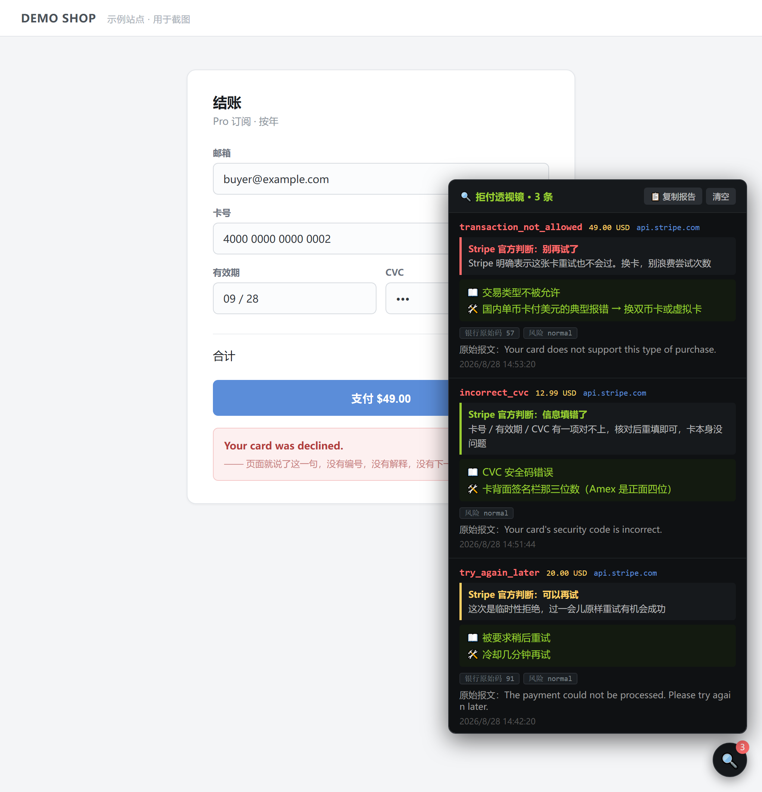
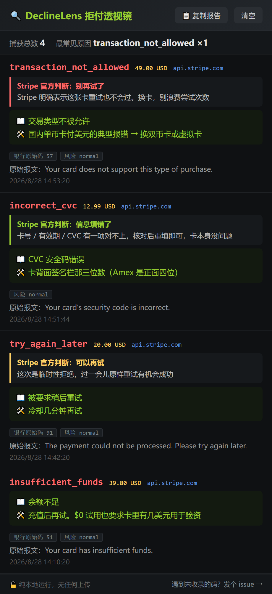

# DeclineLens 拒付透视镜

中文 ｜ [English](README.en.md)

[](https://github.com/luck2026228/DeclineLens/actions/workflows/ci.yml)
[](https://github.com/luck2026228/DeclineLens/releases/latest)
[](LICENSE)

境外支付被拒的时候，页面上通常只有一句 "Your card was declined."。但 Stripe 的响应里其实写清楚了到底为什么，只是前端没拿出来显示。这个工具把它捞出来，翻成中文，再告诉你下一步该干什么。

纯本地跑，一次网络请求都不发。浏览器插件和油猴脚本两个版本，功能一样，挑一个装。

[English](README.en.md)

## 装

### 油猴脚本（推荐）

先装 [Tampermonkey](https://www.tampermonkey.net/) 或 [Violentmonkey](https://violentmonkey.github.io/)，然后点这个链接：

**[DeclineLens.user.js](https://github.com/luck2026228/DeclineLens/raw/main/DeclineLens.user.js)**

管理器会弹出安装确认页，点「安装」就完事了，往后自动更新。要是没弹窗，把链接打开、全选复制，Tampermonkey → 添加新脚本 → 粘贴 → `Ctrl+S`。

Tampermonkey 图标的下拉菜单里还有三条命令：打开面板（浮球被页面挡住时用）、复制最近一条报告、清空记录。

### Chrome / Edge 插件

1. 从 [Releases](https://github.com/luck2026228/DeclineLens/releases/latest) 下 `DeclineLens-v3.1.2-chrome.zip`
2. 解压到一个不会随手删掉的目录，Chrome 每次启动都要从这个路径读
3. 地址栏输 `chrome://extensions`，右上角打开开发者模式
4. 点「加载已解压的扩展程序」，选中刚才那个目录

克隆下来直接加载仓库根目录也行，`manifest.json` 就在根上。多出来的 `build.py`、`test.js` 这些 Chrome 会忽略。

### Firefox 插件

下 firefox 那个 zip 解压，地址栏输 `about:debugging#/runtime/this-firefox`，「临时载入附加组件」选目录里的 `manifest.json`。

然后有一步别漏：**`about:addons` → DeclineLens → 权限 → 允许「访问所有网站的数据」**。Firefox 的 `scripting.registerContentScripts` 要求扩展持有目标页面的主机权限，不授权的话官方注入通道根本不启动，会静默退化成 script 标签注入，而那条路会被带 CSP 的站点挡掉，`checkout.stripe.com` 自己就是。

另外「临时载入」重启浏览器就失效，每次开机都得重来。所以 Firefox 上还是用油猴版省事，功能完全一样。

### 装完

不用配置，不用重启。正常付款，成功的话你看不见任何东西（零记录时浮球是完全隐藏的）。一旦被拒，右下角出现浮球，插件版则是工具栏图标，点开看原因。

## 为什么会有这个东西

我自己在境外付款被卡了两天。页面上就那一句 Your card was declined，没有编号，没有解释。于是开始猜：余额不够？卡不支持境外？被风控了？3DS 没过？每猜一次都得重刷订单、重填卡号、等一次超时，而且猜错了你根本不知道自己猜错了。

后来 F12 打开 Network 翻那个 402 请求，响应体里躺着这些东西：

```json
{
  "error": {
    "code": "card_declined",
    "decline_code": "transaction_not_allowed",
    "advice_code": "do_not_try_again",
    "message": "Your card does not support this type of purchase.",
    "type": "card_error"
  },
  "outcome": { "network_decline_code": "57", "risk_level": "normal" }
}
```

`transaction_not_allowed`，意思是这张卡不支持这一类消费（订阅、跨境、某些商户类别），跟余额一毛钱关系都没有。旁边那个 `advice_code: "do_not_try_again"` 更直接，Stripe 就是在说：别试了，试一百次也这样，换卡吧。

我猜了两天的答案，第一次失败的时候就已经在响应里了。

同一句 declined 底下能藏着完全不同的情况：

| 响应里的码 | 到底是什么事 |
| --- | --- |
| `insufficient_funds` | 余额不够，换张卡或者充钱 |
| `transaction_not_allowed` | 卡不支持这类消费，重试没用 |
| `do_not_honor` | 发卡行不说原因就是拒，得打电话问银行 |
| `lost_card` / `stolen_card` | 卡挂失或报失了，别再试，越试风控越紧 |
| `try_again_later` | 临时故障，等几分钟原样再来一次 |
| `authentication_required` | 要 3DS 验证，弹窗被拦了或者压根没弹 |
| `card_velocity_exceeded` | 短时间刷太多次，被频率风控，等一阵子 |

七种情况的正确做法完全不同，其中两种越试越糟。而页面上它们长得一模一样。

## 长什么样

一条记录读起来是这样：

```
transaction_not_allowed                       14:32:07  shop.example.com
   为什么   这张卡不支持这类消费（订阅 / 跨境 / 特定商户类别）
   怎么办   换一张卡。Stripe 官方建议：不要重试（do_not_try_again）
   金额     49.00 USD   ·   HTTP 402   ·   银行原始码 57   ·   风险 normal
```

油猴版是右下角一个浮球，有记录才出现，带角标计数，点开是面板：



插件版点工具栏图标弹窗。它比油猴版多一条黄色警示栏：某个站点的钩子被 CSP 挡住的话，它会把域名列出来告诉你。



> 这两张图是 `python make_screenshots.py` 拿真正的界面代码渲染的（无头浏览器喂假数据），不是手画的示意图。界面改了重跑一遍就跟上。图里的域名、金额、时间全是编的。

## 它不干什么

- 不能让一张被拒的卡变成能用的卡。它只解释，不施法。
- 不改变支付结果。请求原样送走，响应 `clone` 一份自己看，原始那份原样交回页面。解析代码整段抛异常也包在 `try/catch` 里，不影响付款。
- 不碰卡号、CVV 和任何输入框。它读的是 HTTP 响应，不是页面 DOM。
- 不联网。一次请求都不发，连检查更新都没有。

## 隐私

几条承诺，都能自己对着代码验：

- **只有匹配 `PAY_URL` 那一行正则的响应才会被读取**，别的请求连 `.clone()` 都不执行。那行正则在 [pagehook.js](pagehook.js) 里，它就是这个项目的隐私边界。
- 每条记录只落 11 个字段（时间、域名、HTTP 状态码、原因码、金额这些），原始响应体不存。v2.1 存过 600 字节，里面可能夹着邮箱、姓名、账单地址，v3 直接砍了。
- 数据只在你自己的浏览器里。用的是 `storage.local` 不是 `storage.sync`，油猴版用 `GM_setValue`，都不同步不上传。最多留 200 条，清空按钮是真删。
- Chrome 权限就一个 `storage`。没有 `tabs`，没有 `webRequest`，没有 `host_permissions`。
- 全仓库 grep 一遍：没有对外的 fetch、没有 XHR、没有 sendBeacon、没有 img 打点。

逐条的完整版在 [PRIVACY.md](PRIVACY.md)。

## 两个版本挑哪个

先装油猴版。一步装好，自动更新，重启浏览器不掉，抗 CSP 也更好（油猴在浏览器层注入，不吃页面那套 CSP）。插件版留给不想装油猴框架的人，以及以后上应用商店。

功能上两版是一样的，共用同一份字典和同一条抓取规则，有一项自检专门逐字比对这两处，防它们偷偷跑偏。

两个都装也不会记两遍。DOM 上插了一面旗子（`data-declinelens`），谁先跑谁装钩子，后到的自己退出。但你会看到两套界面，而且存储是各自独立的，同一笔拒付只会出现在先装上钩子的那一边。想干净就只留一个。

## 遇到没收录的原因码

Stripe 的码一直在加，字典里那 55 条肯定有漏的。碰上没收录的，界面会直接显示原始码，并给一个报告入口。

最省事的做法：点「复制报告」，[开个 issue](https://github.com/luck2026228/DeclineLens/issues/new?template=missing-code.yml) 粘进去。报告是纯文本，只有那 11 个诊断字段，不含隐私信息，可以直接贴。

想自己动手也简单，`dict.js` 里一条长这样：

```js
insufficient_funds: {
  why: "卡里余额不够，或者超出了信用额度",
  fix: "换一张卡，或者给这张卡充钱之后重试",
},
```

加完跑一遍 `node test.js`，再 `python build.py`。别手改 `DeclineLens.user.js`，那是生成物，下次构建就被覆盖了。`why` 和 `fix` 的写法要求在 [CONTRIBUTING.md](CONTRIBUTING.md) 里，这是本项目最欢迎的一类贡献。

## 想改代码

```bash
node test.js        # 60 项自检，零依赖，不需要浏览器
python build.py     # 出两个扩展 zip 和油猴脚本
```

只要 Python 3 标准库，不用 pip 装任何东西。装了 Node 的话 `build.py` 会顺手调 `node --check` 做一遍语法自检。

代码怎么组织的、为什么非得是两个文件、有哪些参数能调、踩过哪些坑，都写在 [ARCHITECTURE.md](ARCHITECTURE.md)。提 PR 之前看一眼 [CONTRIBUTING.md](CONTRIBUTING.md)。

## 其他文档

[内部结构](ARCHITECTURE.md) ·
[更新日志](CHANGELOG.md) ·
[隐私政策](PRIVACY.md) ·
[安全策略](SECURITY.md) ·
[参与进来](CONTRIBUTING.md) ·
[路线图](ROADMAP.md) ·
[遇到问题](SUPPORT.md) ·
[行为准则](CODE_OF_CONDUCT.md)

## License

MIT。拿去改、拿去卖、嵌进自己的产品都行，留个版权声明就好。

字典那部分（`dict.js`）要是你在别的项目里用上了，我会挺高兴的。那 55 条加 12 条报文规则是一条一条对着 Stripe 文档和真实响应攒出来的。
